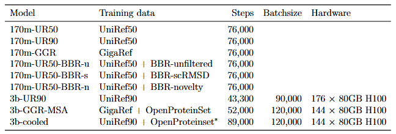

# Project
## Description

In this work, we combined genomic-derived protein sequences, metagenomics, structure-based synthetic sequences, and MSAs to create the Dayhoff Atlas of protein data and language models. 
We first created a large-scale natural protein dataset, GigaRef,  by combining and reclustering sequences from metagenomic databases with UniRef100. With 3.3B sequences in 1.7B clusters, GigaRef is the largest open dataset of natural proteins to date. 

To infuse the benefits of protein structure information into sequence space, we generated the first large-scale structure-based synthetic dataset, called BackboneRef, by sampling 240,830 backbone structures from a structure-based generative model and then using them to design a total of 46M synthetic sequences.
Using UniRef, GigaRef, BackboneRef, and 16M MSAs from OpenProteinSet, we then trained the Dayhoff series of PLMs, which use a a hybrid state-space-model (SSM) and transformer architecture along with a mixture-of-experts (MoE) mechanism to enable the long context lengths needed to combine single sequences and MSAs at scale. 
Dayhoff models make accurate zero-shot predictions of mutations effects, generate sequences conditioned on aligned or unaligned homologs, and generate shorter Cas9s that preserve the functional domain architecture. 

Larger models, metagenomic sequences, and structure-based augmentation all increased the expression rates of unconditional generations in E. coli. 
Finally, we generated, characterized, and release 16M synthetic sequences as DayhoffRef

<!-- insert preprint link -->
Dayhoff is described in this [preprint](preprint); if you use the code from this repository or the results, please cite the preprint 

## Installation
**Requirements**: 
* PyTorch: 2.2 and above
* CUDA 12.0 and above
* Optionally install Flash Attention following installation instructions here: https://github.com/Dao-AILab/flash-attention

To download our code, we recommend creating a clean conda environment with Python 3.10.16

```bash
conda create --name dayhoff python=3.10.16
```

In that new environment, install PyTorch, mamba-ssm, and causal-conv1d. Then install Dayhoff. Optionally, install Flash Attention 1 or 2.

```bash
pip install dayhoff # For bleeding edge: pip install git+https://github.com/microsoft/dayhoff.git
```
### Mamba-ssm and causal-conv1d recommendations

It is sometimes challenenging to properly install these packages just using pip. The following two errors are common when simply using pip install:
* packages installed correctly, but when loading models you get "ValueError: Fast Mamba kernels are not available. Make sure to they are installed and that the mamba module is on a CUDA device."
* Package instalation of causal-conv1d or mamba-ssm fail during the build

If you encounter any of these erros, try installing using the following commands:

```bash
git clone https://github.com/Dao-AILab/causal-conv1d.git
cd causal-conv1d
git checkout v1.4.0 # current latest version tag
CAUSAL_CONV1D_FORCE_BUILD=TRUE pip install .
cd ..
git clone https://github.com/state-spaces/mamba.git
cd mamba
git checkout v2.2.4 # current latest version tag
CAUSAL_CONV1D_FORCE_BUILD=TRUE CAUSAL_CONV1D_SKIP_CUDA_BUILD=TRUE CAUSAL_CONV1D_FORCE_CXX11_ABI=TRUE pip install --no-build-isolation .
```


## Code and Data Availability
All the datasets and models are hosted in Hugging Face 🤗.
* Datasets: https://huggingface.co/datasets/Microsoft/DayhoffDataset
* Models: https://huggingface.co/Microsoft/Dayhoff

### Available models
The available models in Hugging Face 🤗 are:
* **170M-parameter models:** 170m-GGR, 170m-UR50, 170m-UR90, 170m-UR50-BBR-s, 170m-UR50-BBR-u, 170m-UR50-BBR-n
* **3B-parameter models:** 3b-GGR-MSA, 3b-UR90, 3b-cooled

The following table provides details about each model


### Available datasets
All datasets in Hugging Face are available in three formats: FASTA, Arrow, and JSONL.

<!-- Add split sizes GB -->
The datasets are:
* **GigaRef (no singletons = clustered)**.
    * Splits: train, test
* **GigaRef (only singletons)**
    * Splits: train
* **UniRef50**
    * Splits: train, test, rtest, valid
* **UniRef90**
    * Splits: train, test, rtest, valid
* **DayhoffRef**
    * Splits: train
* **BackboneRef**
    * Splits: rfdiffusion_unfiltered (BBR-u), rfdiffusion_scrmsd (BBR-s), rfdiffusion_novelty (BBR-n)

To read any of the datasets use Hugging Face's load_dataset, which will use the Arrow format for maximum efficieny. Below are some examples on how to load the datasets:

```python
gigaref_singletons_train = load_dataset("microsoft/DayhoffDataset",
                  name="gigaref_only_singletons",
                  split="train")

gigaref_clustered_train = load_dataset("microsoft/DayhoffDataset",
                  name="gigaref_no_singletons",
                  split="train")

uniref50_train = load_dataset("microsoft/DayhoffDataset",
                  name="uniref50",
                  split = "train")

uniref90_train = load_dataset("microsoft/DayhoffDataset",
                  name="uniref90",
                  split = "train")

backboneref_both_filter = load_dataset("microsoft/DayhoffDataset",
                  name="backboneref",
                  split = "rfdiffusion_novelty")
                
dayhoffref = load_dataset("microsoft/DayhoffDataset",
                  name="dayhoffref",
                  split = "train")

```

For the largest datasets, consider using streaming = True.


## Unconditional generation

We provide two scripts with different complexity and functionality.

For a simple script that covers most use cases, use src/generate.py. Below is a sample code to generate 10 sequence with at most 100 residues:

```bash
python src/generate.py --out-dir generations --model 170m-UR50-BBR-n --max-length 100 --n-generations 10 --temp 1.0 --min-p 0.0 --random-seed 1 --no-fa2
```

For the exact script used in the paper consider using the analysis/generate.py script. Sample code:

```bash
python analysis/generate.py checkpoints/jamba-170m-seqsam-36w/ data jamba-170m-seqsam-36w --n_generations=5
```

## Homologue-conditioned generation

The generate_from_homologs script performs sequence generation conditioned on evolutionarily-related homologous sequences modeled as multiple sequence alignments (MSAs)

The following code specifies the folder where MSAs in fasta format are stored and selects two specific MSAs for conditional generation. The list of MSAs within the MSAs dir can also be specified via an --include-pattern argument.

```bash
python src/generate_from_homologs.py --model 3b-GGR-MSA --msas-dir MSAs --task sequence --out-dir generations --msa-file-names 100220484.fasta 10123434.fasta --temp 1.0 --min-p 0.0 --max-length 768 --random-seed 1 --no-fa2
```

## Contributing

This project welcomes contributions and suggestions.  Most contributions require you to agree to a
Contributor License Agreement (CLA) declaring that you have the right to, and actually do, grant us
the rights to use your contribution. For details, visit https://cla.opensource.microsoft.com.

When you submit a pull request, a CLA bot will automatically determine whether you need to provide
a CLA and decorate the PR appropriately (e.g., status check, comment). Simply follow the instructions
provided by the bot. You will only need to do this once across all repos using our CLA.

This project has adopted the [Microsoft Open Source Code of Conduct](https://opensource.microsoft.com/codeofconduct/).
For more information see the [Code of Conduct FAQ](https://opensource.microsoft.com/codeofconduct/faq/) or
contact [opencode@microsoft.com](mailto:opencode@microsoft.com) with any additional questions or comments.

## Trademarks

This project may contain trademarks or logos for projects, products, or services. Authorized use of Microsoft 
trademarks or logos is subject to and must follow 
[Microsoft's Trademark & Brand Guidelines](https://www.microsoft.com/en-us/legal/intellectualproperty/trademarks/usage/general).
Use of Microsoft trademarks or logos in modified versions of this project must not cause confusion or imply Microsoft sponsorship.
Any use of third-party trademarks or logos are subject to those third-party's policies.

## Disclaimer
The [software/model] described in this repository is provided for research and development use only. The [software/model] is not intended for use in clinical decision-making or for any other clinical use, and the performance of model for clinical use has not been established. You bear sole responsibility for any use of this [software/model], including incorporation into any product intended for clinical use. 
